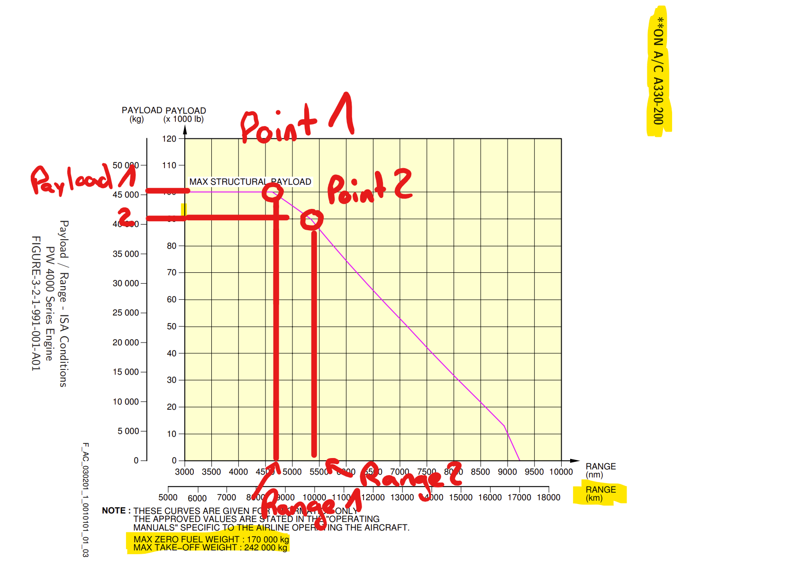
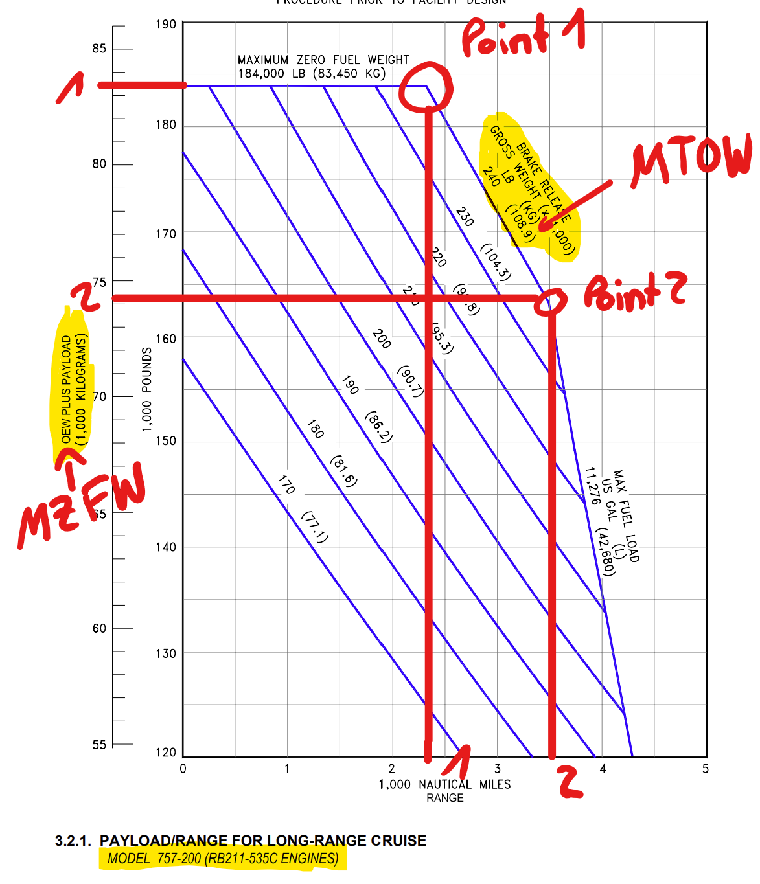

# Aircraft Range

We need to fill the following table of 45 Aircraft regarding the Maximal Take Off Weight (MTOW), the Maximal Zero Fuel Weight (MZFW) and the Range for two points in the payload-range diagram. 
The payload-range diagram can be found in the Aircraft Characteristics for Airport Planning Manuals. 
To find and complete this datatable an estimated workload of 4-6 hours is considered. 

Please use in all cases kg for all weights and km for all ranges!

Aircraft Characteristics for Airport Planning:

[Airbus](https://www.airbus.com/en/airport-operations-and-technical-data/aircraft-characteristics) 

[Boeing](https://www.boeing.com/commercial/airports/plan_manuals.page)

For the Embraer, Canadair and Lockheed Aircraft these documents can be found via Google.

## Example 1 Airbus

As it can be seen in the picture above, the MTOW for Airbus is stated below the graph and accounts for all points on the pink line.
The two points marked are both bending points of this line. From this point, vertically the Range can be found for this point and horizontally the payload. 
To be consistend please always use kg for all weights and km for all ranges. 
In this example, the MZFW is listed below with 170000kg which accounts for max structural payload. 
For Point 2, the reduction of payload, here approximately 4000 kg has to be subtracted for the MZFW of Point B. 
## Example 2 Boeing

For Boeing Aircraft it is slightly different, as the OEW plus the PAYLOAD is given 
on the y-Axis, which is already the MZFW. the MTOW is again given by the violet lines. In the case of multiple lines with different MTOW please take the maximal value. 
Here, the range is given in nautical miles which have to be converted to km. 
For most Boeing Aircraft Types, Payload/Range Diagrams are given for each different engine (here RB211-535C). Mostly these different Payload/Range Diagrams are quite similar. 

## List of Aircraft

| Name                                              | RANGE_POINT_1 | MTOW | MZFW_POINT_1 | RANGE_POINT_2 | MZFW_POINT_2 |
|---------------------------------------------------|---------------|------|--------------|---------------|--------------|
| 757-200                                           |               |      |              |               |              |
| 767-300/300ER                                     |               |      |              |               |              |
| 777-200ER/200LR/233LR                             |               |      |              |               |              |
| A320-100/200                                      |               |      |              |               |              |
| 767-200/ER/EM                                     |               |      |              |               |              |
| 737-800                                           |               |      |              |               |              |
| A319                                              |               |      |              |               |              |
| 737-300                                           |               |      |              |               |              |
| DC9 Super 80/MD81/82/83/88                        |               |      |              |               |              |
| 747-400                                           |               |      |              |               |              |
| 737-700/700LR/Max 7                               |               |      |              |               |              |
| 727-200/231A                                      |               |      |              |               |              |
| A330-200                                          |               |      |              |               |              |
| 767-400/ER                                        |               |      |              |               |              |
| DC-10-30                                          |               |      |              |               |              |
| A321/Lr                                           |               |      |              |               |              |
| 737-400                                           |               |      |              |               |              |
| 737-100/200                                       |               |      |              |               |              |
| 737-500                                           |               |      |              |               |              |
| 747-200/300                                       |               |      |              |               |              |
| MD-11                                             |               |      |              |               |              |
| 757-300                                           |               |      |              |               |              |
| 737-900                                           |               |      |              |               |              |
| 747-100                                           |               |      |              |               |              |
| RJ-700                                            |               |      |              |               |              |
| B787-800 Dreamliner                               |               |      |              |               |              |
| DC-9-30                                           |               |      |              |               |              |
| A330-300/333                                      |               |      |              |               |              |
| Embraer-145                                       |               |      |              |               |              |
| 777-300/300ER/333ER                               |               |      |              |               |              |
| Embraer 190                                       |               |      |              |               |              |
| B787-900 Dreamliner                               |               |      |              |               |              |
| DC-10-10                                          |               |      |              |               |              |
| L-1011-1/100/200                                  |               |      |              |               |              |
| A300-600/R/CF/RCF                                 |               |      |              |               |              |
| 737-900ER                                         |               |      |              |               |              |
| RJ-200ER /RJ-440                                  |               |      |              |               |              |
| MD-90                                             |               |      |              |               |              |
| DC-10-40                                          |               |      |              |               |              |
| 717-200                                           |               |      |              |               |              |
| Embraer ERJ-175                                   |               |      |              |               |              |
| B737 Max 800                                      |               |      |              |               |              |
| 787-10 Dreamliner                                 |               |      |              |               |              |
| A330-900                                          |               |      |              |               |              |
| B737 Max 900                                      |               |      |              |               |              |